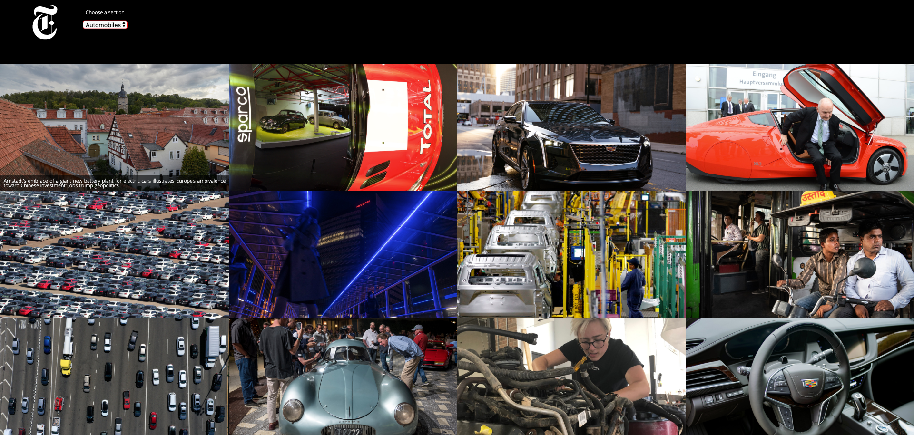
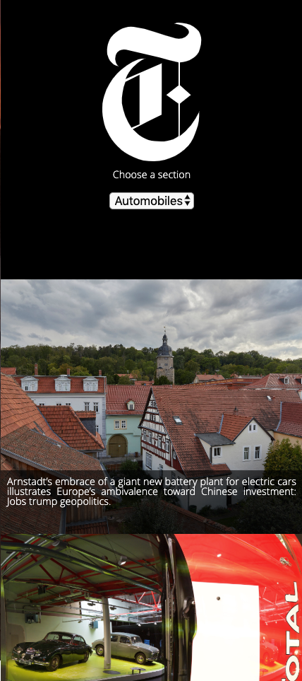

# Instanews - **Project Three**

In this project some new technologies were used like Jquery, SASS, CSS animation, AJAX, jSON and gulp.

## Link to access the website
https://alefaissal.github.io/instanews/

## Versions
All versions of the _**Instanews**_ are in GitHub for evaluation with comments, using present tense verbs and all new features added in each version.

## Some of the tecnologie envolved in this projects include:
* Use of HMTL5, CSS and JavaScript

* Use of SCSS to have: mixins, variables and animation properties
    * Mixins
    * Variables
    * Animation
    * Usage of Extends and Include

* Use of jQuery, simplifying the way to add style and properties to elements from the HTML file

* Usage of gulp, jSon, git and GitHub

## Author
This project was done by Alex Faissal, as an assigment for the Web Developer program from Red Academy.

